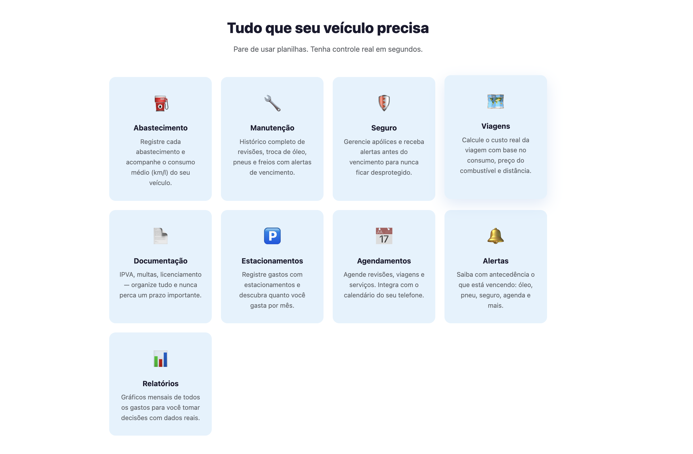

# 🚗 CarDC — Gastos e Manutenção Veicular

> Controle total dos seus gastos e manutenções com o veículo. Abastecimentos, revisões, alertas e histórico completo na palma da mão.

🌐 **Prévia do site:** [sitedc.online/cardc](https://sitedc.online/cardc)

---

## 📱 Sobre o app

CarDC é um aplicativo Flutter para Android e iOS que centraliza o controle financeiro e de manutenção do seu veículo. Registre abastecimentos, acompanhe o consumo, receba alertas de revisão e tenha um histórico completo sempre à mão.

---

## ✨ Funcionalidades

- **Controle de abastecimentos** — litros, preço por litro e total gasto
- **Cálculo de consumo médio** — km/L automático por abastecimento
- **Registro de manutenções** — troca de óleo, filtros, revisões e mais
- **Alertas de manutenção** — notificações por km ou data
- **Histórico completo** — todos os registros do veículo em um só lugar
- **Múltiplos veículos** — gerenciar mais de um carro/moto
- **Relatórios de gastos** — visualização por período
- **Offline-first** — funciona sem internet

---

## 🛠️ Tecnologias

| Camada | Tecnologia |
|---|---|
| Mobile | Flutter · Dart |
| Arquitetura | Clean Architecture · MVVM |
| Estado | Provider |
| Backend | Firebase Firestore · Firebase Auth |
| Notificações | Firebase Cloud Messaging |
| CI/CD | GitHub Actions |
| Lojas | Google Play · Apple App Store |

---

## 📦 Plataformas

- ✅ Android (Play Store)
- ✅ iOS (App Store)

---

## 🔗 Links

| | |
|---|---|
| 🌐 Site oficial | [sitedc.online/cardc](https://sitedc.online/cardc) |
| 📱 Play Store | [Download Android](https://play.google.com/store/apps/details?id=com.dorcaschagas.car_controll) |
| 🍎 App Store | [Download iOS](https://apps.apple.com/br/app/cardc-gastos-e-manutencao/id6754003722) |
| 👩‍💻 Desenvolvedora | [sitedc.online](https://sitedc.online/configurar-ambiente/sobre/index.html) |

---

> Desenvolvido por [Dorcas Chagas](https://sitedc.online/configurar-ambiente/sobre/index.html) · Software DC
